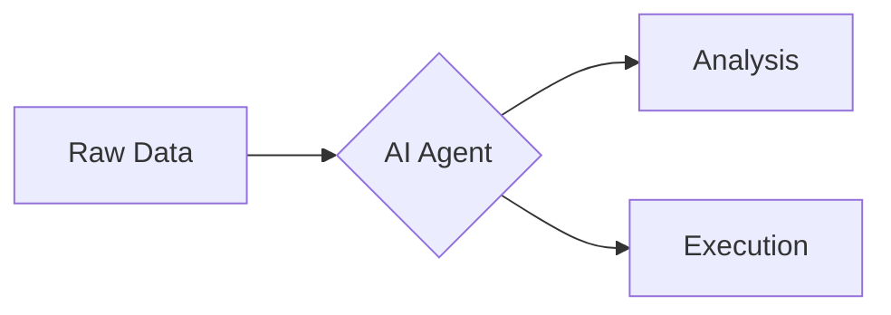

# Obsidian Advanced Slides Few-Shot Learning Guide

Advanced Slides is an Obsidian plugin that transforms Markdown into Reveal.js presentations. Use this guide to generate professional, highly structured, and visually dynamic slide decks.

## 1. Default "Consult" Template
- **Visual Hierarchy:** Every slide MUST follow: `::: title` → `Content (Grid/Block)` → `::: source (Optional)`.

### Titles & Footers
- **Titles:** Always wrapped in `::: title`. Syntax: `### **Bold Title**` or `### _**Italic Title**_`.
- **Sources:** Always wrapped in `::: source`. Use for citations or "Next Step" hints.

## 2. Mandatory Framework
### Frontmatter & Global Style
```yaml
---
theme: consult
height: 540
margin: 0
maxScale: 4
mermaid:
  themeVariables:
    fontSize: 14px
  flowchart: 
    useMaxWidth: false
    nodeSpacing: 50
    rankSpacing: 80
---

<style>
.horizontal_dotted_line{ border-bottom: 2px dotted gray; }
.small-indent p { margin: 0; }
.small-indent ul { padding-left: 1em; line-height: 1.3; }
.small-indent ul > li { padding: 0; }
ul p { margin-top: 0; }
.force-center { display: flex !important; flex-direction: column; justify-content: center; align-items: center; width: 100%; height: 100%; text-align: center; }
.mermaid-scale-center { position: relative; }
.mermaid-scale-center > .mermaid { position: absolute; left: 50%; top: 50%; transform: translate(-50%, -50%) scale(0.75); transform-origin: center; }
</style>
```

### Slide Template Selection
#### Title Slide
**Annotation**: `<!-- slide template="[[tpl-con-title]]" -->`
**Usage:** Used at the very beginning of the deck.
**Structure:**
```
## Main Title
::: block
#### Subtitle / Date
:::
``` 

#### Agenda/ToC
**Annotation**: `<!-- slide template="[[tpl-con-default-box]]" -->`
**Usage:** For Table of Contents or structured lists.
**Structure:**
```
::: title
### **Agenda**
:::

::: block
List items or summary content
:::
```

#### Chapter/Splash
**Annotation**: `<!-- slide template="[[tpl-con-splash]]" -->`
**Usage:** To mark transitions between major sections.
**Structure:**
```
# **Chapter Name**
### (Optional) Sub-description
```

#### Content
**Annotation**: `<!-- slide template="[[tpl-con-default-slide]]" -->`
**Usage:** For standard informational slides.
**Structure:**
```
::: title
### **Descriptive Title**
:::

Body content (bullet points, code blocks, or grids).
```

## 3. Layout Engineering (The Grid System)
**DIRECTIVE:** Do not settle for single columns. Architect layouts using `<grid>` to position elements precisely.

### Grid Attributes
- `drag="W H"`: Dimensions in % (e.g., `50 100`).
- `drop="X Y | Pos"`: `topleft`, `center`, `bottomright`, etc.
- `bg="color"`: Use for callout boxes (e.g., `#f5f5f5`).
- `pad="T R B L"`: (e.g., `20px 0`).

### Layout Implementation Patterns
- **1:1 Balanced Split:**
```markdown
<grid drag="48 100" drop="left" align="left" pad="0 20px">
- Bullet points...
</grid>
<grid drag="48 100" drop="right">
![[image.png|300]]
</grid>
```
- **Complex Stack (2 Top / 1 Bottom):**
```markdown
<grid drag="45 45" drop="topleft" bg="#f0f0f0">Top Left</grid>
<grid drag="45 45" drop="topright" bg="#e0e0e0">Top Right</grid>
<grid drag="95 45" drop="bottom" bg="#d0d0d0">Full Width Bottom</grid>
```

## 4. Data & Visuals
**DECISION LOGIC:** Use **Obsidian Charts** for rapid representation; use **Reveal.js Charts** for granular aesthetic control.

### Obsidian Charts
```chart
type: bar
labels: [Q1, Q2, Q3, Q4]
series:
  - title: Performance
    data: [10, 50, 30, 90]
```

### Reveal.js Charts (Canvas-Based)
Used for complex datasets requiring custom background colors or specific line tension.
```html
<canvas data-chart="line">
<!-- { "data": { "labels": ["Jan", "Feb"], "datasets": [{ "data": [65, 59], "label": "Rev", "backgroundColor": "rgba(20,220,220,.8)" }] } } -->
</canvas>
```

### Mermaid Diagrams


## 5. Professional Code & Fragments
### Step-by-Step Code Highlighting
**SYNTAX:** Use the `[lines|range]` syntax to guide the audience through code.
- `[1-2|4|5-8]` : Highlights lines 1-2, then 4, then 5-8.
```java [1-2|4|5-8]
public class WeeklyReportAgent {
    @Action
    public Story writeStory(UserInput input) {
        return ai.createObject(input.getContent(), Story.class);
    }
}
```

<not-recommended>
## 6. Fragments: Dynamic Sequencing (Request-Only)
**STRATEGY:** Use fragments only when explicitly requested to reveal information incrementally.

### Fragment Types (Technical Reference)
- `<!-- element class="fragment" -->`: Standard fade-in.
- `<!-- element class="fragment fade-out" -->`: Element disappears on the next step.
- `<!-- element class="fragment highlight-red" -->`: Turns text red instead of fading in.
- `<!-- element class="fragment fade-in-then-out" -->`: Appears then disappears in one sequence.
- `<!-- element class="fragment fade-up" -->`: Slides up while fading in (also: `fade-down`, `fade-left`, `fade-right`).

### Precise Order Control (`data-fragment-index`)
Use indices to trigger elements out of document order.
- `Appears Last <!-- element class="fragment" data-fragment-index="4" -->`
- `Appears First <!-- element class="fragment" data-fragment-index="1" -->`
</not-recommended>

## 7. Icons: Font Awesome Integration
**MANDATORY:** Use Icons to replace low-impact bullets. Support all four syntax types.

### Syntax
- **Basic:** `<i color="coral" class="fas fa-envelope fa-4x"/>`
- **Advanced:** `<i class="fas fa-quote-left fa-2x fa-pull-left fa-border"></i>` (For emphasized callouts).

### Capability Classes
- **Sizing:** `fa-xs`, `fa-sm`, `fa-lg`, `fa-2x`, `fa-3x`, `fa-5x`, `fa-7x`.
- **Rotating:** `fa-rotate-90`, `fa-rotate-180`, `fa-rotate-270`, `fa-flip-horizontal`, `fa-flip-vertical`, `fa-flip-both`.
- **Animating:** `fa-spin` (Rotation), `fa-pulse` (8-step pulse).
- **Common Symbols:** `fa-spinner`, `fa-circle-notch`, `fa-sync`, `fa-cog`, `fa-stroopwafel`.

<not-recommended>
## 8. Auto-Animate: Professional Transitions (Request-Only)
**CORE RULE:** Use Auto-Animate only when explicitly requested to morph elements between slides. Use identical element structures to anchor the animation.

### Implementation Pattern
```markdown
<!-- .slide: data-auto-animate -->
# Title

---
<!-- .slide: data-auto-animate -->
# Title
##### **Subtitle**
###### *Author - 2026*
```

### Strategic Constraints
- **Do NOT Overuse:** Limit to 1-2 transitions per chapter to avoid "visual noise."
- **Anchor Elements:** Keep the "moving" elements' IDs or text identical for seamless interpolation.
</not-recommended>

## ⚠️ CRITICAL AI INSTRUCTIONS
1. **NO Auto-Fragments:** NEVER use `+` or `)` for list items. ALWAYS use `<!-- element class="fragment" -->` when fragments are requested.
2. **NO Emojis:** Use **Font Awesome icons** (e.g., ``) exclusively.
3. **NO Global Overrides:** Use the provided `<style>` block and inline styles ONLY.
4. **NO Vertical Slides/Notes:** Forbidden. Focus only on high-impact horizontal content.
5. **Layout Mastery:** Evaluate content and choose the most effective Grid configuration. Don't play it safe with single columns.
6. **Fragments & Auto-Animate:** NEVER use fragments (`class="fragment"`) or Auto-Animate (`data-auto-animate`) unless the user explicitly asks for them.
